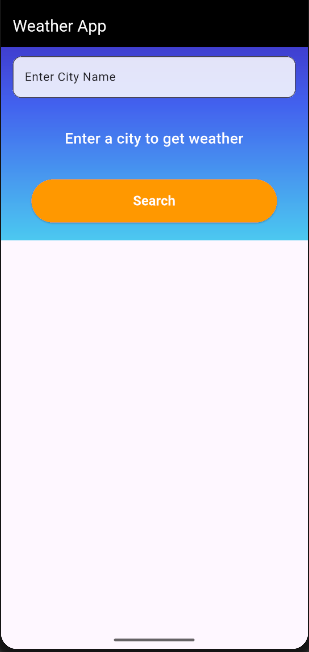
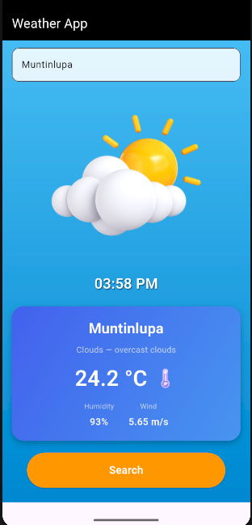
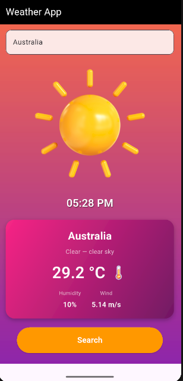
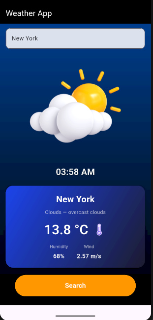

# 🌦️ Flutter Weather App

A Flutter app that shows real-time weather using OpenWeatherMap API.

---

## 🚀 Setup

1. **Clone the project**
   git clone https://github.com/GELO13125/flutter_weather_app.git
   cd flutter_weather_app

2. **Install Flutter**
   Flutter install guide: https://docs.flutter.dev/get-started/install

3. **Check your Flutter installation**
   Open your terminal and run:

   flutter doctor

👉 This will check if Flutter is installed correctly on your computer.

4. **Download all required packages**
    In the terminal, run:

    flutter pub get

👉 This will install all the dependencies your app needs.

5. **Add your API key**

    Inside your project folder, go to the lib folder.

    Find a file named constants.dart.

    Find this code inside:

    const String apiKey = "YOUR_API_KEY";

👉 Replace "YOUR_API_KEY" with your actual weather API key.

6. **Run the app**
    Start the app by running:

    flutter run

👉 This will launch the app on your connected phone or emulator.

---

## 📸 Screenshots

Here are some screenshots of the app:

|        Home Screen            |            Weather Example 1          |            Weather Example 2          |
|-------------------------------|---------------------------------------|---------------------------------------|
|  |  |  |

|            Weather Example 3          |
|---------------------------------------|
|  |
